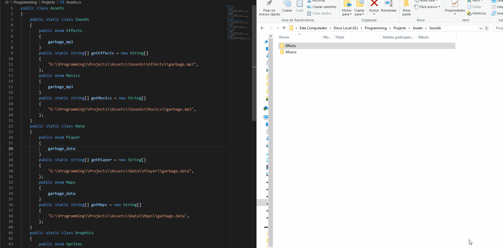

# ResourceEnumGenerator
It is capable to generate dynamically code based on the config file for the folder selected.

I wrote it for creating enums based on a resources folder.

<h2> Functionalities:</h2>
<ul>
  <li>Generating JSON or Javascript Object</li>
  <li>Generating Enum for Java</li>
  <li>Generating Enum for C styled languages</li>
  <li>String variable type</li>
</ul>

<ol>
  <li>The program auto generates some default settings.config file (for C#) in its executable directory</li>
  <li>If you're using windows, you will be able to see in the SystemTray one icon</li>
  <li>By right-clicking on it, some user-friendly functionalities will appear</li>
  <li>The program will listen to one input folder, in the settings.config it is as PATH_TO_WATCH</li>
  <li>After that, you should update its PATH_TO_CREATE_FILE (aka Output Path)</li>
  <li>You can configure the settings.config for creating enumerators for your language</li>
  <li>You will be able to drag and drop files inside the folder listening, it will dynamically update your enumerators</li>
</ol>

<h2> Explanation on settings.config</h2>

<table>
  <tr>
    <th>Setting Name</th>
    <th>Default Config</th>
    <th>Functionality</th>
  </tr>
<tr> <td>PATH_TO_WATCH= </td> <td>./ </td> <td>Input path(always recursive) </tr>
  <tr> <td>PATH_RELATIVE_TO= </td> <td> </td> <td>Path where the enum constant will point to, defaulted on null</tr>
  <tr> <td>PATH_TO_CREATE_FILE= </td> <td>./enumwriter.cs </td> <td>Output path</td></tr>
  <tr> <td>WILL_USE_CLASS_NAME= </td> <td>true </td> <td>Class name on top of file(Defaulted on input directory name)</td> </tr>
  <tr> <td>RELATIVIZE_PATH_NAMES_TO_GENERATOR_DIRECTORY= </td> <td>true </td> <td>It will relativize the input and output path based on the executable current directory (Recommended when constantly changing drives)</td> </tr>
  <tr> <td>PACKAGE_DECLARATOR= </td> <td>package </td> <td>It will be the declarator for the package/module for the output file</td></tr>
  <tr> <td>PACKAGE_NAME= </td> <td> </td> <td>The package name, if not defined, no package will be added at the start, necessary in case you're doing a java project</td></tr>
  <tr> <td>IMPORT_DECLARATOR= </td> <td>import </td> <td>The import keyword, as it rarely needs to import something, it will use Java structure</td>
  <tr> <td>IMPORT_LIST= </td> <td> </td> <td>Import list separated by ','</td></tr> 
   
  <tr> <td>CUSTOM_CLASS_NAME= </td> <td> </td> <td>If you don't want the default class name</td> </tr>
  <tr> <td>CLASS_NAME_START_WITH_CAPITAL= </td> <td>true </td> <td>Capital for the default class name</td> </tr>
  <tr> <td>CLASS_DECLARATOR= </td> <td>public class  </td> <td>Prefix for declarating the class </td></tr>
  <tr> <td>IS_ENUM_MODE= </td> <td>true </td> <td> For alternating between pure variable assignment </td></tr>
  <tr> <td>ENUM_DECLARATOR= </td> <td>public enum  </td> <td>Prefix for declarating enums</td> </tr>
  <tr> <td>POST_ENUM_DECLARATION= </td> <td> </td> <td>Sufix after the enum name</td> </tr>
<tr> <td>AFTER_ENUM_LAST_BRACKET= </td> <td> </td> <td>You can use comma for json (or javascript object)</td></tr>
  <tr> <td>ENUM_CONST_SURROUND_WITH= </td> <td> </td> <td>Useful for json object, tested with double quotes </td></tr>
  <tr> <td>ENUM_START_WITH_CAPITAL= </td> <td>true </td> <td>Capital for the enum names</td></tr>
  <tr> <td>ENUM_TO_UPPERCASE= </td> <td>false </td> <td>Uppercase for enums</td></tr>
  <tr> <td>ENUM_CONST_TO_UPPERCASE= </td> <td>false </td> <td>Uppercase for enum constants</td></tr>
  <tr> <td>INNER_CLASS_DECLARATOR= </td> <td>public static class  </td> <td>Prefix for declaring inner objects(folders with folders inside) when recursion is made necessary</td></tr>
  <tr> <td>POST_INNER_CLASS_DECLARATOR= </td> <td> </td> <td>Sufix the inner class name</td></tr>
  <tr> <td>STRING_ARRAY_DECLARATOR= </td> <td>public static string[]  </td> <td>String declarator (as it will be linked with the enum used as an ID for accessign the resource name) </td> </tr>
  <tr> <td>POST_STRING_ARRAY_DECLARATOR= </td> <td> = new String[] </td> <td>Sufix for the string array name</td> </tr>
  <tr> <td>STRING_ARRAY_PREFIX= </td> <td>get </td> <td>Prefix for the string array name</td></tr>
  <tr> <td>WILL_START_STRING_ARRAY_WITH_CAPITAL= </td> <td>true </td> <td>Capital for the string array name </td> </tr>
  <tr> <td>STRING_ARRAY_SUFIX= </td> <td> </td> <td>If you prefer using sufixes</td></tr>
  <tr> <td>STRING_ARRAY_START_BLOCK_SYMBOL= </td> <td>{ </td> <td>Defaulted on { symbol, as in many languages is a starting block definition</td></tr>
  <tr> <td>STRING_ARRAY_END_BLOCK_SYMBOL= </td> <td>}; </td> <td>For ending the string array definition block</td></tr>
<tr> <td>POST_STRING_DEFINITION= </td> <td>, </td> <td>After every string is defined inside the block, the comma will be placed</td></tr>
  <tr> <td>ASSIGN_SYMBOL= </td> <td>= </td> <td>Did thinking about json, where the assign symbol is ':'</td> </tr>
  <tr> <td>WILL_USE_ASSIGN= </td> <td>false </td> <td>If you need to use the assign symbol(Only on non-enum mode) </td></tr>
  <tr> <td>WILL_REMOVE_EXTENSION= </td> <td>false </td> <td>Every extension is maintained by replacing with a _, if you prefer, you can remove the extension from the enum name</td></tr>
  <tr> <td>WILL_REMOVE_EXTENSION_FROM_STRING= </td> <td>false </td> <td>It will remove every extension from the string constants (added for Unity purposes)</td></tr>
  <tr> <td>IGNORE_EXTENSIONS= </td> <td>.config, .java, .git, .classpath, .project, .meta </td> <td>Will ignore archives with these extensions</td></tr>
  <tr> <td>IGNORE_PATHS= </td> <td>.git, .vscode, node_modules </td> <td>Will ignore paths with these prefixes</td></tr>
</table>

<h1 style = "color: #aa0000">WARNING</h1>
Every setting must:
<ul>
  <li>End with '= ', yes, there is one default space after every "=" symbol</li>
  <li>Not listen to Desktop, it won't work</li>
  <li>Must not be running 2 instances for the same input/output</li>
</ul>
Folders must:
<ul>
  <li>Not have files with foldes in the same path, these files will be ignored</li>
  <li>Not contain ~ character, as it is one default character for temporary files, it guarantees support for visual studio</li>
</ul>

If you ever find some bug, contact me
